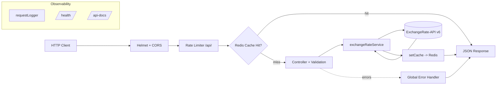

# Currency Converter API — Step-by-Step Build Guide

> **Archived: original build playbook.** This document is the original roadmap used to build the Currency Converter API from an empty folder to a deployable service. It is preserved as a making-of narrative; the codebase may have evolved since the guide was written. For the current setup, architecture, and deployment notes, see [../README.md](../README.md).

---

> **Project Summary:** A production-ready RESTful API for real-time currency conversion across 160+ currencies, powered by ExchangeRate-API. The service exposes endpoints to convert an amount between two currencies, fetch all rates for a base currency, and list supported currencies. It is built around a clean layered architecture (routes → controllers → services), with Redis caching and graceful degradation (the API stays fully functional when Redis is unavailable). Security and reliability layers include Helmet headers, CORS, IP-based rate limiting, ISO 4217 input validation, a centralized error handler, structured request logging, graceful shutdown, and a Swagger (OpenAPI 3.0) documentation surface. The test suite uses Jest and Supertest with the external API mocked.

Each step below is a self-contained prompt. Execute them in order.

Stack: Node.js, Express 5, Redis, Axios, Swagger (swagger-jsdoc + swagger-ui-express), Helmet, CORS, express-rate-limit, dotenv, Jest, Supertest, Render.

---

## Table of Contents

**PHASE 1 — Backend Foundation**

- STEP 1 — Project Scaffolding & Dependency Setup
- STEP 2 — Environment Configuration & Validation
- STEP 3 — Redis Client with Graceful Degradation
- STEP 4 — Express App Assembly & Entry Point

**PHASE 2 — Backend Resources**

- STEP 5 — External API Service Layer
- STEP 6 — Response Helper & Cache Key Utilities
- STEP 7 — Cache Middleware
- STEP 8 — Cross-Cutting Middleware (Rate Limiter, Logger, Error Handler)
- STEP 9 — Controllers & Validation
- STEP 10 — Routes & Swagger Annotations

**PHASE 3 — Documentation & API Surface**

- STEP 11 — Swagger / OpenAPI Configuration
- STEP 12 — Health Check & Root Landing Page

**PHASE 4 — Testing & Quality**

- STEP 13 — Test Harness Setup (Jest + Supertest)
- STEP 14 — Unit & Integration Tests

**PHASE 5 — Polish & Deploy**

- STEP 15 — Deployment Configuration (Render)
- STEP 16 — Community Health Files & README

**Appendices**

- Appendix A — Shared Constants & Conventions
- Appendix B — Standard Response Contract
- Appendix C — Common Pitfalls
- Appendix D — Pre-Flight Checklist

---

## Global Build Rules (apply to EVERY step)

- **No git operations.** Do not run `git` commands, do not commit, and do not push. Version control is handled manually by the user.
- Do not install unapproved packages. Only add a dependency when the step explicitly requires it.
- Do not start long-running processes (servers, watchers) unless the step requests it.
- Treat every step as self-contained: it states its goal, the files it touches, and its acceptance criteria.
- Keep code modern and consistent: CommonJS modules, `async/await`, native methods first, descriptive camelCase identifiers, English code, DRY.
- Prioritize security, input validation, accessibility (for HTML output), performance, and deployment readiness.
- Never commit secrets. The `.env` file is git-ignored; only `.env.example` is tracked.

---

## Architecture at a Glance



The request pipeline is layered: global security middleware runs first, then the rate limiter (scoped to `/api/`), then a route-level cache middleware that short-circuits on a cache hit. On a miss, the controller validates inputs and delegates to the service layer, which calls the external ExchangeRate-API. Successful results are written back to Redis. All errors funnel into a single global error handler that maps them to a consistent response contract. Redis is optional throughout: if it is down, cache reads and writes are silently skipped.

---

# PHASE 1 — BACKEND FOUNDATION

---

## STEP 1 — Project Scaffolding & Dependency Setup

**Goal:** Establish the project root, package metadata, scripts, and runtime dependencies.

**Files to create:**

- `package.json`
- `.gitignore`

**Dependencies (runtime):** `express`, `cors`, `helmet`, `axios`, `redis`, `dotenv`, `express-rate-limit`, `swagger-jsdoc`, `swagger-ui-express`.

**Implementation notes:**

- Use CommonJS (`"type": "commonjs"`) and set `"main": "src/server.js"`.
- Define scripts: `start` (`node src/server.js`) and `dev` (`node --watch src/server.js`).
- `.gitignore` must exclude `node_modules/`, `.env`, `*.log`, `dist/`, `coverage/`, and OS files.

**Acceptance:** `npm install` completes; `package.json` lists all runtime dependencies with pinned caret ranges.

---

## STEP 2 — Environment Configuration & Validation

**Goal:** Centralize environment variables and fail fast when a required secret is missing.

**Files to create:**

- `src/config/env.js`
- `.env.example`

**Implementation notes:**

- Load `dotenv` at the top of `env.js`.
- Export an `env` object with: `PORT` (default `3000`), `NODE_ENV` (default `development`), `EXCHANGE_RATE_API_KEY`, `EXCHANGE_RATE_BASE_URL` (`https://v6.exchangerate-api.com/v6`), `REDIS_URL` (default `redis://localhost:6379`), `CACHE_TTL` (parsed int, default `3600`), and `PUBLIC_URL` (optional, used by Swagger as the production server URL).
- If `EXCHANGE_RATE_API_KEY` is missing, log a helpful message and `process.exit(1)`.
- `.env.example` documents every variable with comments and no real secrets.

**Acceptance:** Importing `env.js` without an API key exits with code 1; with a key set, it returns a fully populated config object.

---

## STEP 3 — Redis Client with Graceful Degradation

**Goal:** Provide an optional Redis connection that never crashes the app when unavailable.

**Files to create:**

- `src/config/redis.js`

**Implementation notes:**

- Use the `redis` package `createClient` with `url: env.REDIS_URL` and a `socket.reconnectStrategy` that stops retrying after 3 attempts (return `false`) and otherwise backs off (`Math.min(retries * 500, 3000)`), plus a `connectTimeout` of 5000 ms.
- Track an internal `isRedisConnected` flag via `ready`, `end`, and `error` event handlers.
- Export `connectRedis()`, `getRedisClient()`, and `getRedisStatus()`.
- `connectRedis()` must wrap `connect()` in try/catch and only warn (never throw) on failure.

**Acceptance:** With no Redis running, `connectRedis()` resolves, `getRedisStatus()` returns `false`, and the process keeps running.

---

## STEP 4 — Express App Assembly & Entry Point

**Goal:** Wire global middleware, mount routes, and create the server lifecycle.

**Files to create:**

- `src/app.js`
- `src/server.js`

**Implementation notes:**

- In `app.js`: apply `helmet()`, `cors()`, `express.json()`, then the request logger; mount the rate limiter on `/api/`; mount Swagger UI at `/api-docs`; serve the root landing page at `/`; mount the health route and `/api/v1` currency routes; add a 404 JSON handler and the global error handler last.
- In `src/server.js`: call `connectRedis()`, then `app.listen(env.PORT)` with a formatted startup banner. Register `SIGTERM`/`SIGINT` handlers for graceful shutdown that close the HTTP server and quit Redis (guarded by `getRedisStatus()`), then `process.exit(0)`.

**Acceptance:** `npm run dev` starts the server, prints the banner, and `GET /` returns the landing page.

---

# PHASE 2 — BACKEND RESOURCES

---

## STEP 5 — External API Service Layer

**Goal:** Encapsulate all ExchangeRate-API calls behind a single module.

**Files to create:**

- `src/services/exchangeRateService.js`

**Implementation notes:**

- Create a pre-configured Axios instance with `baseURL` = `${EXCHANGE_RATE_BASE_URL}/${EXCHANGE_RATE_API_KEY}` and a 10s timeout.
- Export three functions:
  - `fetchLatestRates(baseCurrency)` → `GET /latest/{base}` → `{ base, rates, lastUpdate }`.
  - `fetchPairConversion(from, to, amount)` → `GET /pair/{from}/{to}/{amount}` → `{ from, to, rate, amount, result }`.
  - `fetchSupportedCurrencies()` → `GET /codes` → array of `{ code, name }`.
- Each function checks `data.result === "success"` and throws with `data["error-type"]` otherwise.

**Acceptance:** Each function returns a normalized shape and throws a descriptive error on a non-success payload.

---

## STEP 6 — Response Helper & Cache Key Utilities

**Goal:** Standardize responses and centralize cache key generation to avoid read/write key drift.

**Files to create:**

- `src/utils/responseHelper.js`
- `src/utils/cacheKeys.js`

**Implementation notes:**

- `responseHelper`: `sendSuccess(res, data, statusCode = 200)` → `{ success: true, data }`; `sendError(res, message, statusCode = 500, errors = null)` → `{ success: false, message, errors? }`.
- `cacheKeys`: export `buildConvertKey(from, to, amount)`, `buildRatesKey(base)`, and `CURRENCIES_KEY`. Normalize currency codes to uppercase and parse the amount with `Number.parseFloat` so that `"100.00"`, `"1e2"`, and `100` all produce the same key. This single source of truth is used by both the cache middleware (read path) and the controllers (write path).

**Acceptance:** `buildConvertKey("usd","eur","100.00")` equals `buildConvertKey("USD","EUR",100)`.

---

## STEP 7 — Cache Middleware

**Goal:** Serve cached responses on a hit and provide a safe write helper.

**Files to create:**

- `src/middlewares/cache.js`

**Implementation notes:**

- `cacheMiddleware(keyGenerator)` returns an async middleware that no-ops when `getRedisStatus()` is false, reads the key, and on a hit responds `{ success: true, source: "cache", data }`. Wrap reads in try/catch and only warn on errors.
- `setCache(key, data, ttl = env.CACHE_TTL)` writes via `setEx` only when Redis is connected; failures warn but never throw.

**Acceptance:** With Redis down, the middleware calls `next()` and never blocks the request.

---

## STEP 8 — Cross-Cutting Middleware (Rate Limiter, Logger, Error Handler)

**Goal:** Add protection, observability, and a single error funnel.

**Files to create:**

- `src/middlewares/rateLimiter.js`
- `src/middlewares/requestLogger.js`
- `src/middlewares/errorHandler.js`

**Implementation notes:**

- `rateLimiter`: `express-rate-limit` with a 15-minute window, max 100 requests, `standardHeaders: true`, `legacyHeaders: false`, and a JSON `message`.
- `requestLogger`: measure duration with `process.hrtime.bigint()`, log on `res.finish` with ANSI colors per method and status class, plus a formatted duration.
- `errorHandler`: map Axios `err.response` statuses (404 → not found, 429 → upstream limit, else 502), handle `ValidationError` → 400, and fall back to `err.statusCode || 500`. Always respond via `sendError`.

**Acceptance:** A thrown `ValidationError` produces a 400; an Axios 404 produces a 404 with a descriptive message.

---

## STEP 9 — Controllers & Validation

**Goal:** Validate inputs, call the service, and write the cache.

**Files to create:**

- `src/controllers/currencyController.js`

**Implementation notes:**

- Add `validateCurrencyCode(code, fieldName)` enforcing the ISO 4217 pattern `/^[A-Z]{3}$/`, throwing a `ValidationError` when invalid.
- `convertCurrency`: validate `from`/`to`, parse `amount` with `Number.parseFloat`, reject non-finite or non-positive amounts, and reject amounts above `MAX_AMOUNT` (1 trillion). On success, call `fetchPairConversion`, then `setCache(buildConvertKey(...))`, then `sendSuccess`.
- `getExchangeRates`: validate `base`, call `fetchLatestRates`, cache with `buildRatesKey`, respond.
- `getSupportedCurrencies`: call `fetchSupportedCurrencies`, cache under `CURRENCIES_KEY` with a 24h TTL, respond with `{ count, currencies }`.
- All handlers use try/catch and forward errors via `next(error)`.

**Acceptance:** Invalid codes and bad amounts return 400 before any external call is made.

---

## STEP 10 — Routes & Swagger Annotations

**Goal:** Expose the currency endpoints with cache middleware and inline OpenAPI docs.

**Files to create:**

- `src/routes/currencyRoutes.js`

**Implementation notes:**

- Build an Express `Router`. For each route, attach `cacheMiddleware` using the shared key builders, then the controller:
  - `GET /convert` → `buildConvertKey(req.query.from, req.query.to, req.query.amount)`.
  - `GET /rates/:base` → `buildRatesKey(req.params.base)`.
  - `GET /currencies` → `CURRENCIES_KEY`.
- Add `@swagger` JSDoc blocks defining component schemas (`ConversionResult`, `RatesResult`, `CurrenciesList`, `ErrorResponse`) and per-endpoint documentation.

**Acceptance:** The three endpoints respond correctly and appear in Swagger UI.

---

# PHASE 3 — DOCUMENTATION & API SURFACE

---

## STEP 11 — Swagger / OpenAPI Configuration

**Goal:** Generate an OpenAPI 3.0 spec from route annotations.

**Files to create:**

- `src/config/swagger.js`

**Implementation notes:**

- Read `version` dynamically from `package.json` (do not hardcode).
- Build the `servers` array with `http://localhost:${PORT}` and, when `env.PUBLIC_URL` is set, prepend it as the production server.
- Set `apis: ["./src/routes/*.js"]` so annotations are picked up.

**Acceptance:** `/api-docs` renders all endpoints; the version matches `package.json`.

---

## STEP 12 — Health Check & Root Landing Page

**Goal:** Provide an operational probe and a friendly entry page.

**Files to create:**

- `src/routes/healthRoute.js`
- Root landing page handler in `src/app.js`

**Implementation notes:**

- `GET /health` returns `{ status, version, uptime, redis, memoryUsage, timestamp }`, where `redis` reflects `getRedisStatus()`.
- The root page is a self-contained, responsive HTML document (no external assets) with accessible links to `/api-docs` and `/health`. Keep markup semantic and use a mobile breakpoint.

**Acceptance:** `GET /health` returns 200 with `status: "ok"`; `GET /` renders the landing page on mobile and desktop widths.

---

# PHASE 4 — TESTING & QUALITY

---

## STEP 13 — Test Harness Setup (Jest + Supertest)

**Goal:** Enable fast, network-free tests.

**Files to create:**

- `tests/setup.js`
- Jest config + scripts in `package.json`

**Dependencies (dev):** `jest`, `supertest`.

**Implementation notes:**

- `tests/setup.js` sets `EXCHANGE_RATE_API_KEY` and `NODE_ENV=test` before any module that validates env is loaded.
- In `package.json`, add `test` (`jest --runInBand`), `test:watch`, `test:coverage`, and a `jest` block with `testEnvironment: "node"`, `setupFiles`, and `collectCoverageFrom: ["src/**/*.js"]`.

**Acceptance:** `npm test` boots Jest without requiring a real API key or network.

---

## STEP 14 — Unit & Integration Tests

**Goal:** Cover the cache key logic and the HTTP surface.

**Files to create:**

- `tests/cacheKeys.test.js`
- `tests/currency.test.js`

**Implementation notes:**

- Unit-test `buildConvertKey`, `buildRatesKey`, and `CURRENCIES_KEY`, including amount normalization equivalence.
- Integration-test the app with Supertest while mocking `exchangeRateService` (`jest.mock`). Cover: a valid conversion, invalid currency code, non-positive amount, over-maximum amount, missing amount, rates happy path, invalid base, currencies list, `/health`, and an unknown route (404).

**Acceptance:** All tests pass with `npm test`.

---

# PHASE 5 — POLISH & DEPLOY

---

## STEP 15 — Deployment Configuration (Render)

**Goal:** Make the service deployable as a Render web service.

**Files to create:**

- `render.yaml`

**Implementation notes:**

- Define a `web` service with `runtime: node`, `plan: free`, `buildCommand: npm install`, `startCommand: node src/server.js`.
- Set `NODE_ENV=production`, mark `EXCHANGE_RATE_API_KEY` and `PUBLIC_URL` as `sync: false` (entered in the dashboard), and set `CACHE_TTL`.

**Acceptance:** Render auto-detects `render.yaml`; the app boots without Redis when only the API key is provided.

---

## STEP 16 — Community Health Files & README

**Goal:** Round out the repository with documentation and contribution standards.

**Files to create:**

- `.github/ISSUE_TEMPLATE/{bug_report.yml,feature_request.yml,config.yml}`
- `.github/PULL_REQUEST_TEMPLATE.md`
- `.github/CONTRIBUTING.md`, `.github/CODE_OF_CONDUCT.md`, `.github/SECURITY.md`
- `LICENSE`
- `README.md`

**Implementation notes:**

- Keep community health files under `.github/` so GitHub auto-detects them.
- The README documents features, installation, testing, the request flow, endpoints, environment variables, and the project structure. Keep links pointing at `.github/` for moved files.

**Acceptance:** GitHub Community Standards detect the conduct, contributing, and security files; the README links resolve.

---

# Appendix A — Shared Constants & Conventions

- **Currency code pattern:** `/^[A-Z]{3}$/` (ISO 4217).
- **`MAX_AMOUNT`:** `1_000_000_000_000` (1 trillion) upper bound for conversions.
- **Default cache TTL:** `3600` seconds; supported-currencies list cached for `86400` seconds.
- **External base URL:** `https://v6.exchangerate-api.com/v6/{API_KEY}`.
- **Module system:** CommonJS. **Async:** `async/await`. **Naming:** descriptive camelCase, English.

---

# Appendix B — Standard Response Contract

Success:

```json
{ "success": true, "data": { } }
```

Cached success (added by the cache middleware):

```json
{ "success": true, "source": "cache", "data": { } }
```

Error:

```json
{ "success": false, "message": "human readable reason" }
```

Status codes: `400` validation, `404` currency/route not found, `429` rate limit, `502` upstream API error, `500` internal.

---

# Appendix C — Common Pitfalls

- **Cache key drift:** Generating keys inline in both routes and controllers leads to read/write mismatches (e.g. `"100.0"` vs `100`). Always use `cacheKeys.js`.
- **Hardcoded Swagger version:** Read `version` from `package.json` to avoid drift.
- **Throwing on Redis errors:** Cache read/write failures must warn, never throw, to preserve graceful degradation.
- **`isNaN` for amounts:** Prefer `Number.isFinite` so `Infinity` and `1e400` are rejected.
- **Env required at import time:** Tests must set `EXCHANGE_RATE_API_KEY` before importing the app, or `env.js` will exit the process.

---

# Appendix D — Pre-Flight Checklist

- [ ] `npm install` succeeds and `.env` is configured from `.env.example`.
- [ ] `npm test` passes (network mocked).
- [ ] `npm run dev` boots; `/`, `/health`, and `/api-docs` respond.
- [ ] `GET /api/v1/convert?from=USD&to=EUR&amount=100` returns a normalized result.
- [ ] App still serves requests with Redis stopped (cache disabled).
- [ ] No secrets committed; only `.env.example` is tracked.
